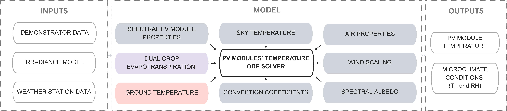

<p align="center">
  
</p>

<h1 align="center">HMT-Agrivoltaics</h1>

<p align="center">
  <strong>Heat &amp; Mass Transfer Modelling in Agrivoltaic Orchards</strong>
</p>

Heat and mass transfer (HMT) utilities and notebooks for open-field bifacial semi-transparent agrivoltaic orchards modelling workflows. 

## What’s in this repo

This repository contains a small set of Python modules, a Jupyter notebook, and bundled input data.

### Repository structure

- `base.ipynb`  main notebook entry point for running/inspecting the workflow.
- `functions_module.py`  helper functions used by the notebook/workflow. 
- `ET_func.py`  evapotranspiration-related utilities (as used in the workflow). 
- `py56FAO/`  local FAO-56 related code/resources used by the project. 
- `Optical.zip`  optical-related input files (zipped). 
- `Weather.zip`  weather input files (zipped).  

## Quick start
### 1) Clone the repository
```bash
git clone https://github.com/marta2amoros/HMT-Agrivoltaics.git
cd HMT-Agrivoltaics
```


### 2) Create a Python environment (recommended)

Using `venv`:

```bash
python -m venv .venv
```
### 3) Install dependencies

Install the packages used in `base.ipynb`:

```bash
pip install pvlib pandas numpy psychrolib matplotlib scipy tmm thermo pyfao56 import-ipynb nbimporter
```
### 4) Unzip input data
```bash
unzip -o Optical.zip -d Optical
unzip -o Weather.zip -d Weather
```

### 5) Run the notebook
```bash
jupyter notebook
```
Open `base.ipynb` and run cells top-to-bottom.


## Workflow

<p align="center">
  
</p>

1. Unzip `Weather.zip` and `Optical.zip` into `Weather/` and `Optical/`.

2. Open and run `base.ipynb`.

3. The notebook calls functions from:

  - `ET_func.py` (evapotranspiration-related routines)

  - `functions_module.py` (shared utilities)

  - `py56FAO/` (FAO-56 related components)

## Data notes

`Weather.zip` contains meteorological inputs and input data used by the case study in the workflow, which can be substituted by other scenarios.

`Optical.zip` contains optical inputs used by the workflow for the specified case study. Other configurations can be adapted.

If you change the input datasets, keep the expected file names and folder structure (or update the paths used in `base.ipynb`).

